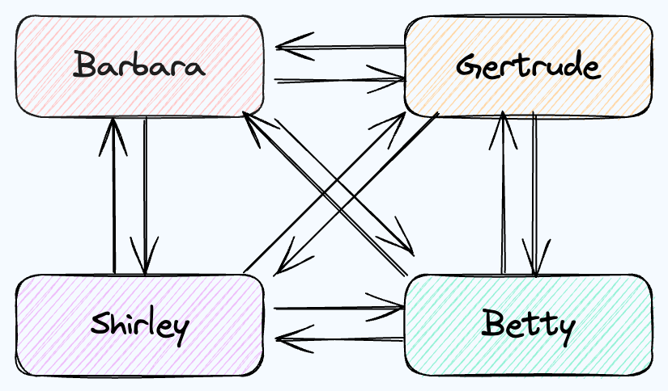

# Heartbeats

This program creates a network of nodes who send heartbeats to each other.

This is used as an experiment in my homelab which consists of a Mac Mini, two Orange Pi 5s, and a Raspberry Pi 3b.

| System Diagram                                                        | Homelab                                                        |
|-----------------------------------------------------------------------|----------------------------------------------------------------|
|  |  |


## Build for MacOS

```
CGO_ENABLED=0 GOOS=darwin GOARCH=arm64 go build -o heartbeats-darwin
```

## Build for Linux

```
CGO_ENABLED=0 GOOS=linux GOARCH=arm64 go build -o heartbeats-linux
```

## Copy to remote machine 

```
scp file user@ip:
```